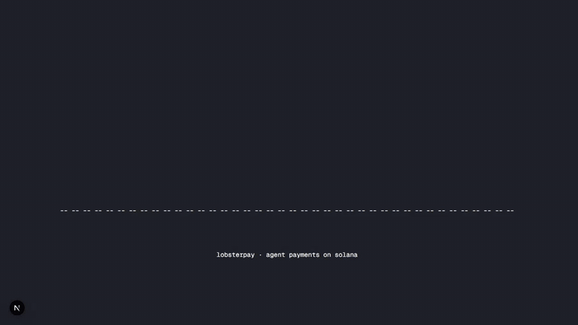

<p align="center">
  
</p>

<h1 align="center">LobsterPay</h1>

<p align="center">
  <strong>Give agents limits, not seed phrases.</strong><br/>
  A permissioned payment layer for AI agents on Solana.
</p>

<p align="center">
  <a href="https://lobsterpay.xyz"></a>
  <a href="https://github.com/sepivip/lobsterpay/actions/workflows/ci.yml"></a>
  <a href="./LICENSE"></a>
  
  
  
</p>

---

## Why

AI agents need to spend money. The options today are bad:

- **Hand the agent a seed phrase.** It now has root access to your wallet forever. One prompt-injection or leaky log line drains everything.
- **Wrap every transaction in human approval.** You just killed the autonomy that made the agent useful.
- **Pre-fund a fresh wallet per agent.** Now you are a treasury manager.

LobsterPay gives the agent an **API key** scoped to a **program-controlled vault**. You set per-tx and daily limits, mint and destination allowlists, and an emergency pause. The agent gets HTTP, not signing authority. Limits are enforced both off-chain (backend) and on-chain (Anchor program guards).

This is the credit-card model for AI agents: a card with a limit, allowlists, and fraud monitoring, instead of unbounded trust.

## Try it

> Live on Solana **devnet** at **[lobsterpay.xyz](https://lobsterpay.xyz)**. Connect a Phantom wallet (set to Devnet), create a vault, mint an API key, and try a payment in under two minutes.
>
> Prefer code? Skip to [Quick Start](#quick-start) or the [SDK example](#example-sdk-usage).

Built for the [Solana Colosseum Hackathon](https://www.colosseum.org/).

## Animations

Short product walkthroughs. GitHub renders these inline when clicked.

| | |
|---|---|
| [Boot sequence](./public/marketing/anim/boot-sequence.mp4) | [Policy gate](./public/marketing/anim/policy-gate.mp4) |
| [USDC stream](./public/marketing/anim/usdc-stream.mp4) | [Rejected payment](./public/marketing/anim/rejected.mp4) |
| [x402 handshake](./public/marketing/anim/x402-handshake.mp4) | [Multi-agent](./public/marketing/anim/multi-agent.mp4) |
| [Fee flow](./public/marketing/anim/fee-flow.mp4) | [Budget ticker](./public/marketing/anim/budget-ticker.mp4) |
| [SIWX sign](./public/marketing/anim/siwx-sign.mp4) | [Terminal demo](./public/marketing/anim/terminal-demo.mp4) |

Live preview pages at [`/experiments/anim`](https://lobsterpay.xyz/experiments/anim).

## Architecture

```
Agent (HTTP/webfetch)
    ↓ API key auth
LobsterPay Backend (Fastify)
    ↓ Policy enforcement
    ↓ Transaction builder
LobsterPay Anchor Program (Solana)
    ↓ PDA-controlled vault
    ↓ transfer_checked CPI
Token accounts
```

**Key design choice:** API-key based, not session-key based. The backend is the execution layer. Session-key signing is a clean extension point for v2.

## Monorepo Structure

| Package | Description |
|---------|-------------|
| `programs/lobsterpay` | Anchor program - vault, policy, pay, swap, withdraw |
| `apps/api` | Fastify backend - auth, limits, tx builder, adapters |
| `apps/web` | Next.js dashboard - vault management, keys, policy, activity |
| `packages/shared` | Zod schemas, types, constants, errors |
| `packages/sdk` | TypeScript SDK for agents |
| `packages/mcp-server` | MCP server - plug LobsterPay into any AI agent |

## Quick Start

### Prerequisites

- Node.js 20+
- pnpm 9+
- Rust + Cargo
- Solana CLI
- Anchor CLI 0.31.1
- Docker (for Postgres + Redis)

### Setup

```bash
# Clone
git clone https://github.com/sepivip/lobsterpay.git
cd lobsterpay

# Install dependencies
pnpm install

# Start databases
docker compose up -d

# Copy env
cp .env.example .env
# Edit .env with your values

# Run database migrations
pnpm db:migrate

# Build packages
pnpm build

# Build Anchor program
anchor build

# Run Anchor tests
anchor test
```

### Development

```bash
# Start backend
pnpm dev:api

# Start frontend (separate terminal)
pnpm dev:web
```

The API runs on `http://localhost:3001` and the frontend on `http://localhost:3000`.

## API Reference

### Owner Endpoints

| Method | Path | Description |
|--------|------|-------------|
| POST | `/v1/vaults` | Create vault |
| GET | `/v1/vaults/:id` | Get vault details |
| GET | `/v1/vaults/by-owner/:wallet` | Get vault by owner wallet |
| PATCH | `/v1/vaults/:id/policy` | Update vault policy |
| POST | `/v1/vaults/:id/api-keys` | Create API key |
| GET | `/v1/vaults/:id/api-keys` | List API keys |
| POST | `/v1/vaults/:id/api-keys/:keyId/revoke` | Revoke API key |
| GET | `/v1/vaults/:id/activity` | List activity |

### Agent Endpoints (API key auth)

| Method | Path | Description |
|--------|------|-------------|
| GET | `/v1/agent/vault` | Get vault info + effective limits |
| POST | `/v1/agent/actions/pay` | Execute payment |
| POST | `/v1/agent/quotes/swap` | Get swap quote |
| POST | `/v1/agent/actions/swap` | Execute swap |
| POST | `/v1/agent/actions/x402` | Pay x402 endpoint |

### Example: Agent Payment

```bash
curl -X POST http://localhost:3001/v1/agent/actions/pay \
  -H "Authorization: Bearer lp_live_YOUR_KEY" \
  -H "Content-Type: application/json" \
  -d '{
    "mint": "EPjFWdd5AufqSSqeM2qN1xzybapC8G4wEGGkZwyTDt1v",
    "amountAtomic": "1000000",
    "destinationOwner": "7xKXmJ...m4Qp",
    "idempotencyKey": "pay-001",
    "memo": "Service payment"
  }'
```

### Example: SDK Usage

```typescript
import { createClient } from "@lobsterpay/sdk";

const client = createClient("lp_live_YOUR_KEY", "http://localhost:3001");

// Check permissions
const vault = await client.getVault();
console.log(vault.permissions);

// Make a payment
const result = await client.executePay({
  mint: "EPjFWdd5AufqSSqeM2qN1xzybapC8G4wEGGkZwyTDt1v",
  amountAtomic: "1000000",
  destinationOwner: "7xKXmJ...m4Qp",
  idempotencyKey: "pay-001",
});
```

### MCP Server (for AI Agents)

Give any MCP-compatible AI agent (Claude, etc.) the ability to make payments, swaps, and x402 purchases through your LobsterPay vault.

**Tools available:**

| Tool | Description |
|------|-------------|
| `check_vault` | View vault status, balances, spending limits |
| `make_payment` | Send tokens to approved destinations |
| `get_swap_quote` | Preview a token swap |
| `execute_swap` | Execute a swap through DEX aggregator |
| `pay_x402` | Pay a 402-gated HTTP endpoint |
| `list_activity` | Check recent transaction history |

**Setup for Claude Code / Claude Desktop:**

Add to your MCP config (`claude_desktop_config.json` or `.claude/settings.json`):

```json
{
  "mcpServers": {
    "lobsterpay": {
      "command": "npx",
      "args": ["-y", "@lobsterpay/mcp-server"],
      "env": {
        "LOBSTERPAY_API_KEY": "lp_live_YOUR_KEY",
        "LOBSTERPAY_API_URL": "http://localhost:3001"
      }
    }
  }
}
```

Or run directly:

```bash
LOBSTERPAY_API_KEY=lp_live_YOUR_KEY pnpm --filter @lobsterpay/mcp-server start
```

**Example agent prompt:**

> "Pay 5 USDC to 7xKXmJ...m4Qp for the API subscription invoice-042"

The agent will call `make_payment` with the appropriate parameters, and LobsterPay enforces all vault policy limits.

## Anchor Program

Program ID: `A184DBQaCM6qWETbEDJUtr25bSuuTH72sTTixsyoZbtS`

### Instructions

| Instruction | Description |
|-------------|-------------|
| `initialize_vault` | Create vault + policy PDAs |
| `update_policy` | Owner updates policy (limits, allowlists, pause) |
| `ensure_vault_token_account` | Create token account for vault PDA |
| `execute_pay_exact` | Guarded token transfer from vault |
| `execute_swap_exact_in` | Guarded swap (Phase 3 - Jupiter) |
| `withdraw_owner` | Owner withdraws from vault |
| `emergency_pause` | Owner pauses all agent actions |

### Account Layout

**Vault** (82 bytes) - Seeds: `["vault", owner]`
- owner, policy pubkey, bump, created_at, version

**Policy** (760 bytes) - Seeds: `["policy", vault]`
- Limits: max_per_tx, daily_limit, daily_spent, max_slippage
- Allowlists: mints (8), destinations (8), external programs (4)
- Flags: paused, allowed_actions bitmask

### Guards (execute_pay_exact)

1. Vault not paused
2. Action bitmask allows `PAY_EXACT`
3. Mint in allowlist (or allowlist empty = allow all)
4. Destination owner in allowlist
5. Amount > 0
6. Amount ≤ per-tx limit
7. Daily window check + spend tracking
8. Transfer via `transfer_checked` with vault PDA signing

## Security

- Vault funds controlled only by the Anchor program PDA
- API keys stored as SHA-256 hashes only
- Per-tx and daily limits enforced both offchain (backend) and onchain (program)
- All token transfers use `transfer_checked` - never arbitrary instructions
- Idempotency keys prevent double-spending
- Emergency pause immediately blocks all agent actions
- No arbitrary CPI - only allowlisted program IDs

## Tech Stack

- **Onchain:** Anchor 0.31.1, Rust, `anchor-spl` token interface
- **Backend:** Fastify, PostgreSQL, Redis, `@solana/web3.js`
- **Frontend:** Next.js 15, React 19, Tailwind, Solana wallet adapter
- **Swap:** Jupiter v6 API
- **Types:** Zod schemas, strict TypeScript throughout

## Contributing

PRs welcome. See [CONTRIBUTING.md](./CONTRIBUTING.md) for the workflow, and [SECURITY.md](./SECURITY.md) for vulnerability reports (do not open public issues for security).

## License

MIT - see [LICENSE](./LICENSE).
